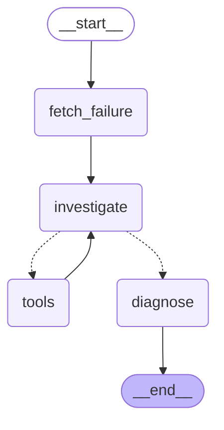

# TraceMe

**An agent that diagnoses a red GitHub Actions run.** It fetches the failing
step's log and the diff since the last green commit, decides for itself whether
it needs to open the source, and streams back an evidence-backed root cause
with a suggested fix.

> _Demo GIF placeholder — record it on `break/subtle`, see HOW_TO_RUN.md §9._
> `docs/demo.gif`

```
  ┌──────────────┐   POST /analyze (SSE)   ┌──────────────┐
  │ Next.js      │ ──────────────────────► │ FastAPI      │
  │ (Vercel)     │ ◄────────────────────── │ (Render)     │
  └──────────────┘   step / token / result └──────┬───────┘
                                                  │
                                    LangGraph, SQLite checkpointer
                                                  │
   START → fetch_failure → investigate ⇄ tools → diagnose → END
             (no LLM)        (model)     (≤6)    (typed)
```

---

## The problem

A build goes red. The log is four thousand lines. The actual error is somewhere
around line 2,900, and the thing at the bottom —
`##[error]Process completed with exit code 1.` — tells you nothing, because it
is appended to *every* failed step regardless of cause.

So you scroll. You find the traceback. You read the test. You open the diff.
Fifteen minutes later you know that someone changed a return type and the test
that broke has nothing to do with the commit message.

TraceMe automates that first fifteen minutes.

## Why an agent, and not a script

This is the question an interviewer will ask, so it is worth being precise:
**the evidence needed differs per failure.**

| Failure | What is sufficient | Tool calls |
|---|---|---|
| A dependency pin that cannot resolve | the log, verbatim | **0** |
| An invalid `python-version` | the log | 0–1 |
| A lint error | the log (rule code + `file:line` are printed) | 1 |
| A test asserting on a constant that changed | the log + one file | 1 |
| **A function that quietly changed its return type** | the log + *choosing* to open a file the diff does not point at | **1–2** |

A fixed pipeline has to decide in advance what to fetch. Fetch too little and
the last row is unanswerable. Fetch everything and the first row costs four
times as much and gets a *worse* answer, because irrelevant source dilutes the
evidence. Only something that can read the log and then decide what to look at
next handles both ends of that table.

The lab repo's `break/subtle` case makes this concrete and falsifiable:
`refresh()` starts returning a plain `dict` instead of a `Token`, in a
three-line hunk, inside a commit whose message and 95-line diff are about a rate
limiter that nothing imports. The traceback names the *test*. The diff summary
names the *rate limiter*. The cause is reachable only by deciding to open
`app/auth.py`. **A script cannot solve that row. That row is the argument.**

## Architecture

Generated from the compiled graph (`python backend/scripts/export_graph.py`), so
it cannot drift from the code:



**`fetch_failure` contains no LLM.** Finding the failed run, the first failing
job, the first failing *step*, downloading the log zip, resolving the last green
commit and diffing it are all unconditional. Letting a model choose to do them
would add latency, cost and failure modes and buy nothing. The agentic part
starts where the certainty ends.

**`investigate ⇄ tools`** is a ReAct loop with a `ToolNode`, a conditional edge,
and a hard cap of six tool calls enforced *in code* — past the cap the model is
invoked without tools bound, so it physically cannot ask for another — plus
LangGraph's `recursion_limit` as a backstop.

**`diagnose`** is a separate node using `with_structured_output(Diagnosis)`.
Asking one call to both investigate and emit strict JSON degrades both.

**Checkpointer:** every analysis is a thread, so `GET /analysis/{thread_id}`
re-opens a finished run — shareable links, no re-spend.

### Where the frameworks actually show up

| | Used for |
|---|---|
| **LangChain** | `init_chat_model` (one provider-agnostic constructor — Groq, OpenAI, Anthropic and Google are four catalog entries, not four code paths), `@tool` (five read-only tools), `bind_tools`, `with_structured_output` |
| **LangGraph** | custom `TypedDict` state, deterministic pre-fetch node, ReAct loop with `ToolNode` + conditional edges, iteration bound + recursion limit, SQLite checkpointer, `stream_mode=["updates","messages"]` |

## The log window is the product

`backend/traceme/log_window.py` is the highest-leverage file here. Given a noisy
4,000-line log it produces ~120 readable lines. Three rules, each learned the
hard way:

1. **Strip first.** ANSI escapes and per-line ISO timestamps eat context budget
   and break the anchor patterns.
2. **Anchor in tiers, and never on noise.** Tier 1 is test-framework/compiler
   output (`E   AssertionError`, `Traceback`, `npm ERR!`, `error TS####`,
   `ModuleNotFoundError`, `panic:`, ruff's `file:line: F401`). Tier 2 is a
   *meaningful* `##[error]`. Tier 3 is anything error-shaped. There is an
   explicit noise list, because anchoring on `##[error]Process completed with
   exit code 1.` throws away the real traceback hundreds of lines earlier — and
   the model then produces a fluent, confident, **wrong** diagnosis with no
   error visible anywhere. That is the worst failure mode in the system, and it
   looks exactly like success.
3. **Always also include the tail.** `=== 1 failed, 402 passed ===` only exists
   at the bottom. Without it the model cannot tell "one test regressed" from
   "the suite is down", and that changes the diagnosis.

The bar, asserted in `tests/test_log_window.py`: a human should be able to
diagnose the failure from the window alone in about fifteen seconds.

## Security

BYOK, and the key never touches persistent state:

- it is **not** in `CIState` — the checkpointer serialises state and
  `GET /analysis/{thread_id}` reads it back out, so a key in state means every
  share link leaks somebody's key;
- it is **not** in checkpoint metadata either. Putting it in
  `config["configurable"]["api_key"]` is *not* sufficient: LangGraph copies
  every `str`/`int`/`bool` in `configurable` into checkpoint metadata. The only
  thing it skips is keys beginning with `__`, hence `__api_key` /
  `__github_token`. A test greps the raw `.sqlite` bytes, because this leak is
  invisible until someone opens the file;
- it is passed as an explicit constructor argument, never by mutating
  `os.environ` — which would leak one user's key into every concurrent request
  in the process;
- it never appears in any SSE event or in the share-link response.

`validate_key()` checks the key **and** that the model actually emits a
`tool_call`, because a model without tool-calling support degrades silently: it
never calls a tool, the graph walks straight to `diagnose`, and the output is
garbage with no error anywhere.

## Repository layout

```
backend/
  traceme/
    repo_input.py   accepts owner/repo, URLs, SSH, .git, tree/ and run URLs
    github.py       GitHub REST client (runs, jobs, log zip, compare, tree)
    log_window.py   ANSI/timestamp stripping + tiered error anchoring + tail
    prefetch.py     the deterministic layer -> FailureContext
    tools.py        the five read-only tools, pinned to the failing SHA
    prompts.py      the system prompt, and why each clause is in it
    models.py       BYOK catalog, per-model context budgets, validate_key
    graph.py        CIState, the four nodes, the bound, the checkpointer
    api.py          FastAPI + SSE (five event types)
  scripts/          run_agent.py, record_demo.py, export_graph.py
  tests/            150 tests, all runnable without credentials
lab-repo/           the demo subject + break.sh (five reproducible failures)
frontend/           Next.js, one page, dark mode, demo button, example chips
```

## Free to run

The default model is Groq's free `llama-3.3-70b-versatile`. No card, no paid
key, nothing to run out.

The interesting constraint that creates: Groq's free plan caps **tokens per
minute** (12K on Llama 3.3, 8K on the gpt-oss models), and one analysis is three
model calls in fifteen seconds, each resending the conversation. So every model
in the catalog carries a `ContextBudget`, and free-tier models get the `TIGHT`
one — a 4,500-character log window instead of 14,000, 4,000-character file reads
instead of 12,000, twelve diff entries instead of forty.

```
normal budget : ~9,100 tokens per analysis   -> 429s on both 8K and 12K TPM
tight  budget : ~6,000 tokens per analysis   -> fits
```

That squeeze is only safe because the windowing scales its *line* counts with
the budget rather than chopping a finished window in half — so the anchored
traceback and the `1 failed, 402 passed` summary both still survive.
`tests/test_budget.py` asserts both ends: small enough to fit, complete enough
to diagnose from. Free-tier models also get `max_retries=5`, so a `retry-after`
turns a rate limit into a slower analysis rather than a failed one.

## Running it

See **[HOW_TO_RUN.md](HOW_TO_RUN.md)** for prereqs, setup, the daily loop, the
live verification checklist, troubleshooting, deployment and the 30-second demo
script.

```bash
cd backend && pip install -r requirements-dev.txt && pytest -q      # 150 passed
uvicorn traceme.api:app --reload                                    # :8000
cd ../frontend && npm install && npm run dev                        # :3000
```

## Limitations

An honest list, because the scope discipline is the reason this shipped in two
days:

- **Public repos only.** A classic PAT with `public_repo` is enough and is what
  the server uses; there is no per-user OAuth, so private repos are out.
- **One repo, one run, one page.** No dashboard, no history, no auth, no
  multi-repo tracking.
- **SQLite on an ephemeral disk.** On Render's free tier the checkpoint file is
  wiped on every redeploy, so share links do not survive a deploy. The
  production path is Postgres (Neon) via `PostgresSaver` — a one-constructor
  swap.
- **No verification of the suggested fix.** It is not applied, not run, not
  tested. Read-only is the whole safety story.
- **Logs expire after ~90 days** and GitHub returns `410`; TraceMe reports that
  rather than guessing.
- **Only the first failing job** is analysed. A matrix build with three distinct
  failures gets one diagnosis.
- **Costs are the user's.** BYOK means no rate limiting or abuse controls beyond
  the provider's own.

## Future work

Per-user GitHub OAuth for private repos · a Postgres checkpointer · a "post as a
PR comment" action (needs write access, so it needs a confirmation step) ·
matrix builds with one diagnosis per failing job · a feedback loop storing
thumbs-up/down per thread and evaluating prompt changes against them · caching
diagnoses by `(head_sha, failed_step)` so re-runs are free · a GitHub App that
comments automatically on red builds.
